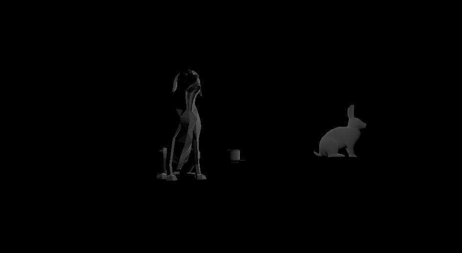

# CMPM163Labs
LAB4
==============

What is the formula given a u value of the uv coordinate (a value between 0 and 1), I get the x value of the pixel to sample from in this 8x8 texture? 
The pixel size is 8.

What is the formula given a v value of the uv coordinate (a value between 0 and 1), I get the y value of the pixel to sample from in this 8x8 texture?
The size will be 8 as well.

What color is sampled from the texture at the uv coordinate (0.375, 0.25)? (sample from the image based on the number your formula gives you i.e. (1, 0) is blue)

Light grey?

===============

LAB3
==============
LAB3 ANIMATION VIDEO https://drive.google.com/open?id=1wN7mkNhpaD6JADXJlJXvXeWhA4LXUotK

For the first cube on the left it was for part 1 where I just simply changed the material used for the cube. The cube in the middle is the one that is in the example video. The one on the far right is the interpolating cube that is in the example, but the colors are changed. And lastly, the one on the top is the one that is with the new shader, using the fragmentShader2.frag.

==============

PART 1 ANIMATION VIDEOS https://drive.google.com/open?id=1Jh8AF6dSeiPuSK1cVdKDn2QXUFXO9oqf

